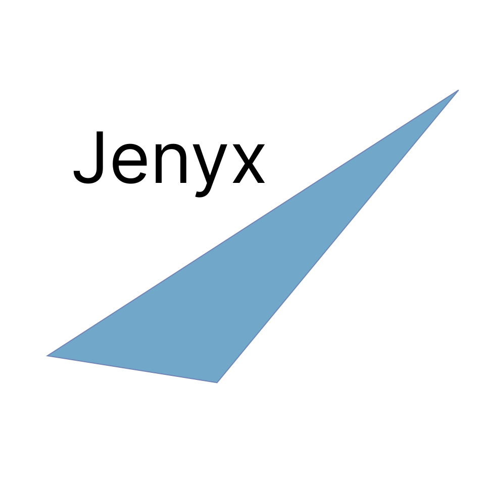

# Jenyx

Jenyx is a lightweight UI components library built with pure JavaScript. No dependencies, no frameworks — just clean JS and CSS-in-JS. Fast, flexible, and easy to use.

## Features

This library offers the following features:

- **Minimal size** — a lightweight library without unnecessary code.
- **Pure JavaScript** — no React, Vue, or other frameworks.
- **CSS-in-JS** — styles are encapsulated within components without external CSS files.
- **Event handling and two-way data binding** — enables easy interaction and synchronization between components and data.

Can be used as a foundation for your own UI kit.

## **Examples**

### Hello World

A simple example demonstrating how to create a basic "Hello World" component using Jenyx.

[View Example](/docs/Hello)

### CountButton

An interactive button that increments a counter with each click. This example showcases event handling and two-way data binding.

[View Example](/docs/CountButton)

### Speech to Text

An example of a simple speech-to-text application.

[View Example](https://github.com/jenyxjs/speech-to-text)

### Tic-Tac-Toe

A Tic-Tac-Toe game was created as an example to showcase the library's capabilities.

- PWA: Progressive Web App support.
- Google Analytics: Integration for tracking and analytics.
- Speech: Text-to-speech and speech recognition

[View Example](https://github.com/jenyxjs/tic-tac-toe)

## Author

If you have any questions or need further assistance, please refer to the Jenyx documentation or reach out to the community.

Developed by Alexey Khakhalin ([Jenyx](https://github.com/jenyxjs))  
Contact: alexey.hahalin@gmail.com

## License

This project is licensed under the MIT License.